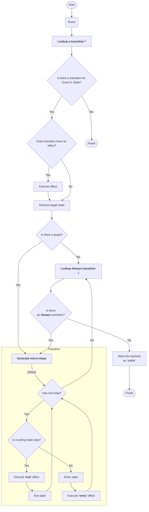

# Main event loop

## Diagram of event loop

Here is the main event loop of any state chart:

## Text version of event loop

1. Receive an event.
2. Look up a transition for the event in the current state (deepest state first).
3. If no transition is found, finish.
4. If the transition has an effect, execute it.
5. Resolve the transition target.
6. If there is a target, generate micro-steps. Otherwise, go to step (8).
7. For each micro-step:
   1. If the next micro-step is an exit:
      1. Execute the exit effect of the state.
      2. Exit the state.
   2. If the next micro-step is an entry:
      1. Enter the state.
      2. Execute the entry effect of the state.
8. Look up an Always transition in the current state (deepest state first).
9. If an Always transition is found (and its guard passes), go to step (4).
10. Mark the machine as stable and finish.

## Transition lookup

A transition lookup in a hierarchial state is deepest state first.

Machine looks for a transition starting from the current state and moving to the top state. Checking each state's transitions to match the received event and against their guards.

A candidate transition that matches the first is executed.

## Always transition

An Always transition lookup happens after handling of any transition:

- A transition that changed state;
- A transition that only executed effect;
- Even after a transition that were prevented because of its guad;

In other words: after any event that might or might not have changed the machines state or executed an effect.

## Micro-steps in transition

When a transition has a target state, the interpreter generates a sequence of micro-steps to move from the current state to the target state. Each micro-step represents either exiting a state or entering a state.

### How micro-steps are generated

The interpreter compares the current state path and the target state path to determine:

- **Common ancestor** — the deepest state that both paths share.
- **Exit segment** — the remaining part of the current path below the common ancestor.
- **Enter segment** — the remaining part of the target path below the common ancestor.

For example, transitioning from `state1.child1` to `state1.child2` produces:

- Common: `state1`
- Exit: `child1`
- Enter: `child2`

### Exit phase

The interpreter first yields exit micro-steps starting from the deepest state and moving up toward the common ancestor (excluding the common ancestor itself). For each exit step:

1. The state's **exit effect** is executed.
2. The state is marked as exited.

### Enter phase

After all exit steps are complete, the interpreter yields entry micro-steps starting from the first state below the common ancestor and moving down to the deepest target state. For each entry step:

1. The state is marked as entered.
2. The state's **entry effect** is executed.

### Special cases

- **Machine start** — when starting from the root state (`''`), an additional entry step for the root is generated before the regular transition steps so that the root's entry effect runs.
- **Reentering** — when a transition targets the same state with `reenter` enabled, the interpreter yields a single exit step followed by a single entry step for that same state.
- **Final states** — if a micro-step enters a final state, it is marked as `final`.

## Example of transition

Consider the following compound state chart:

???

The config for this chart is:

???

### Transition step-by-step

???
