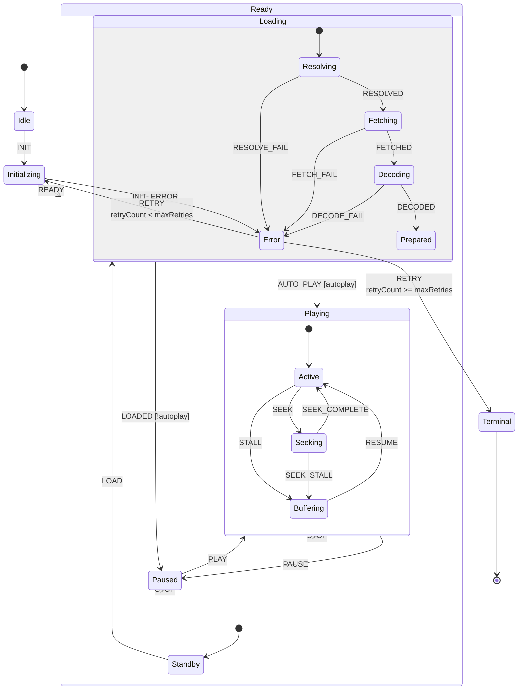

# What is a state machine

A state machine is a way to model behavior through states, transitions, and effects. In this library, a state machine is attached to a model and controls which actions are valid at any given moment.

## State machine and model

A model can exist without a state machine, behaving like a single-state service which's state is always `""`. When you attach a `StateChart`, the model gains:

- A `state` property that tracks the current state path.
- The ability to define transitions between states.
- Lifecycle effects (`entry`, `exit`) tied to states.

## Why use a state machine

State machines make complex component logic explicit and deterministic:

- Invalid transitions are impossible by design.
- Side effects are localised to state entry, exit, and transition actions.
- Guards let you express conditional branching without nested `if` statements scattered through your code.
- The resulting model is serializable and easier to debug.

## Basic concepts

- **State** — a discrete mode the machine can be in (e.g. `idle`, `loading`, `success`).
- **Transition** — a move from one state to another triggered by an event.
- **Effect** — a function that runs when entering, leaving, or transitioning between states.
- **Guard** — a condition that must pass for a transition to be taken.

See [Setup a machine](./setup-machine.md) for how to define one, and [Event loop](./event-loop.md) for how events are processed internally.

## Example: Media player state machine

A state machine shines when the behavior is too tangled for a handful of booleans. The diagram below shows a realistic media player with nested states, error recovery, guards, and multiple exit points.

Trying to model this with ad-hoc flags (`isLoading`, `isBuffering`, `hasError`, `seekPending`, `retryCount`, ...) leads to impossible combinations (e.g. `isLoading && isBuffering`) and scattered guard logic. A state machine makes every configuration explicit and invalidates impossible ones by design.
