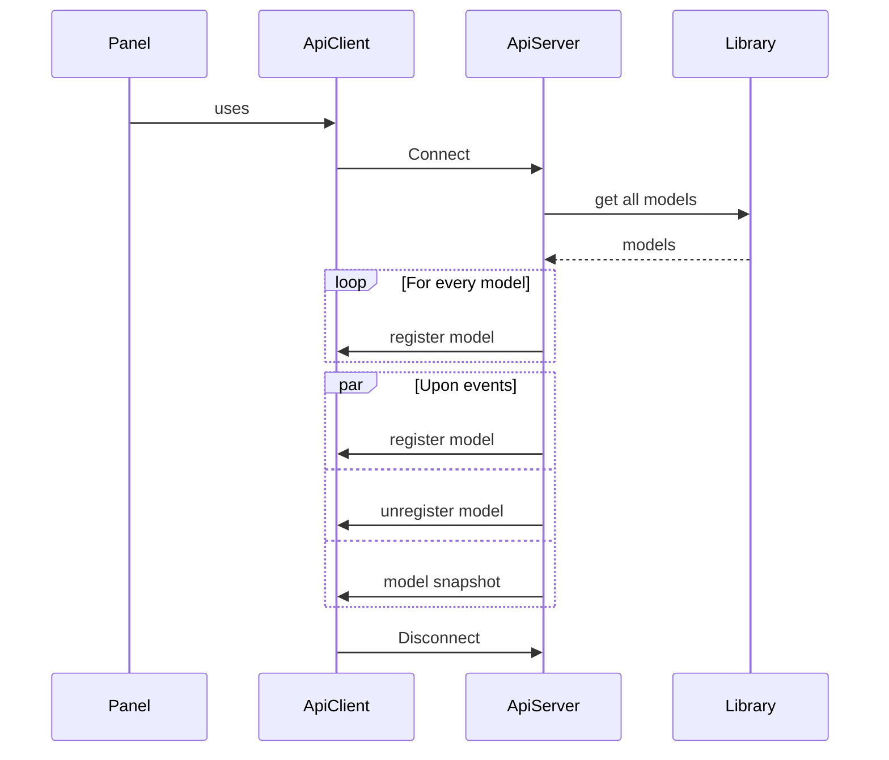
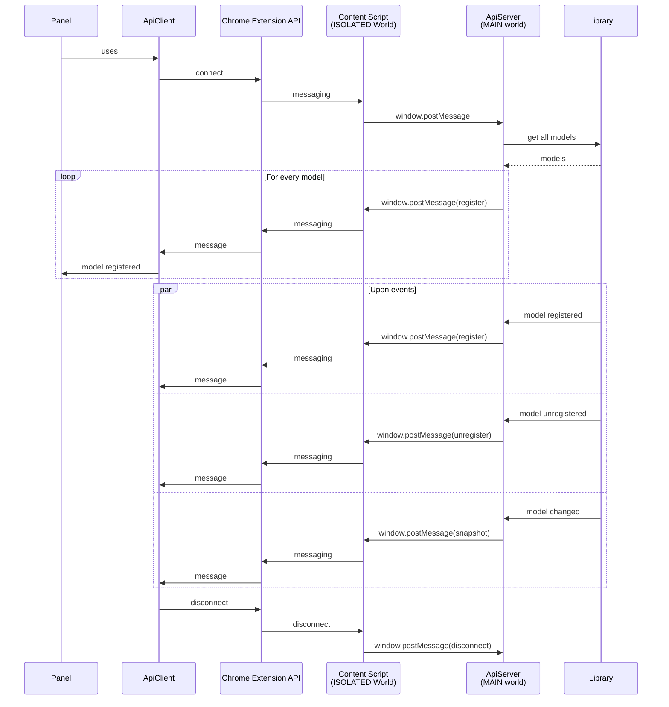

# Devtools

## How devtools work

```
Chrome Extension
│
├── DevTools page / extension context
│     └── DevTools Panel
│           └── ApiClient
│
└── Inspected Page
      │
      ├── Isolated World
      │     └── Content Script
      │
      └── MAIN World
            ├── ApiServer
            └── solid-component-model
```

## The design

The digramm depics communication between panel (a client) and the page's main world (a server). Actors are abstractions, not low-level objects:



## With Chrome API

The lower-level sequence corresponding to the abstract diagramm above:


